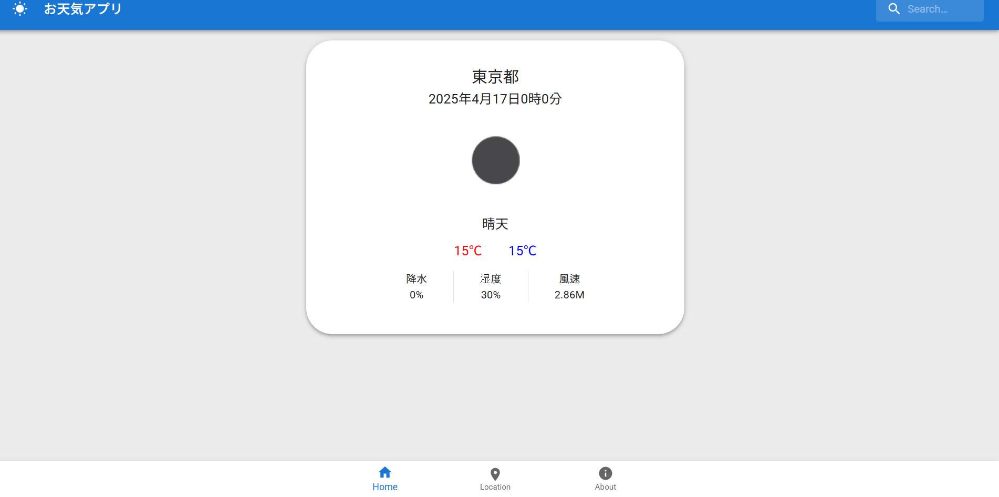
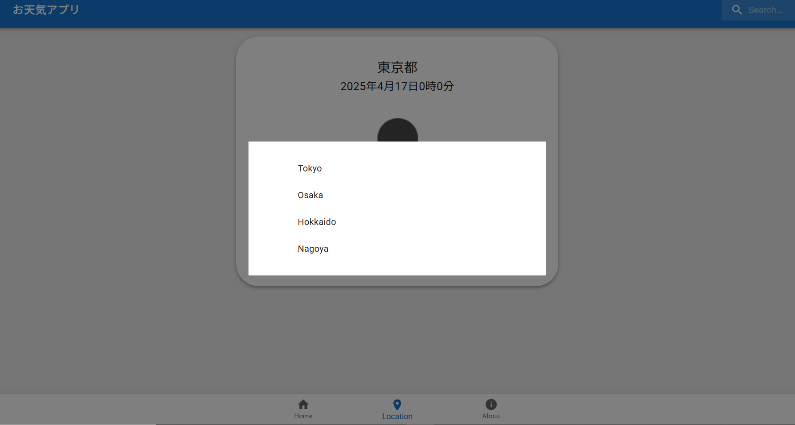
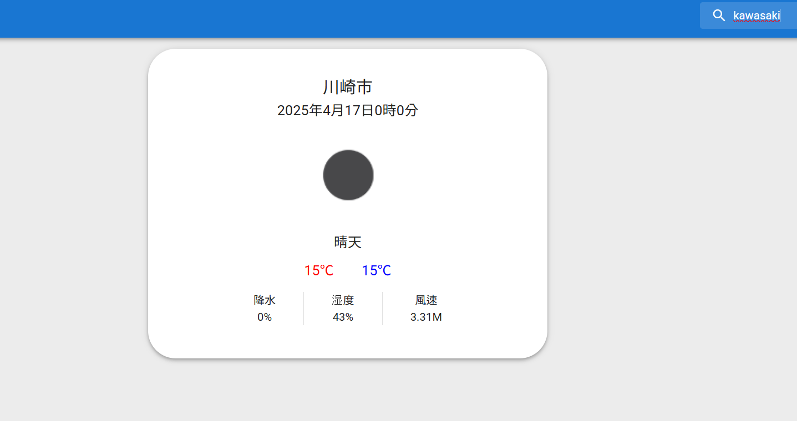
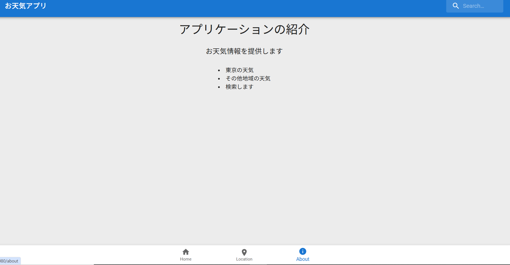

  

 

<h1 align="center">名簿アプリケーションを作成しました。</h1>

### このアプリケーションについて
日本の天気をしれるアプリケーションを作成しました。天気のapiを使って、検索したら日本中の天気をしることができます。

### 機能
1.　ホーム画面
ホーム画面では知りたい地域の最高低気温、天気を知ることができます。

2.　地域検索機能
地域検索をすることでいろんな地域の天気情報を知ることができます。

3.　地域選択
主要地域は選択するだけで情報を取得できるようにしました。

4．about
aboutはこのアプリケーションの説明を入れました

---

---

---

---

---
